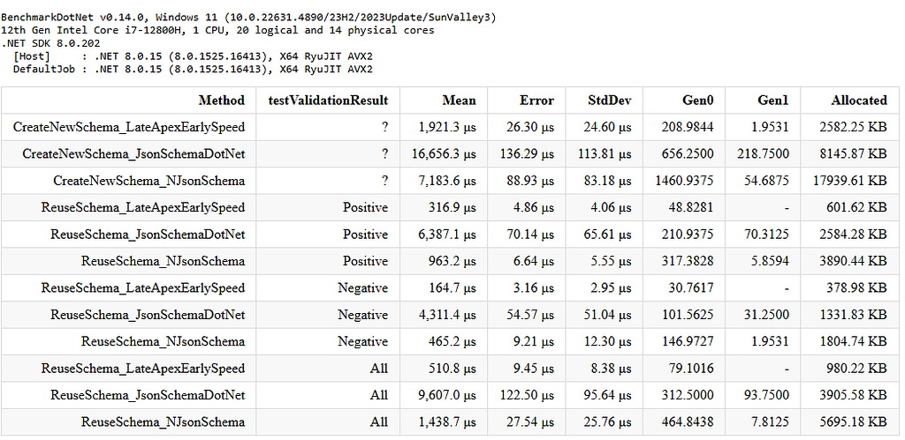
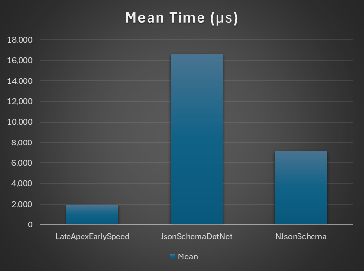
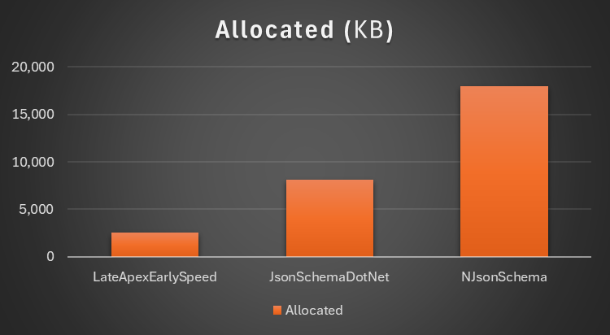
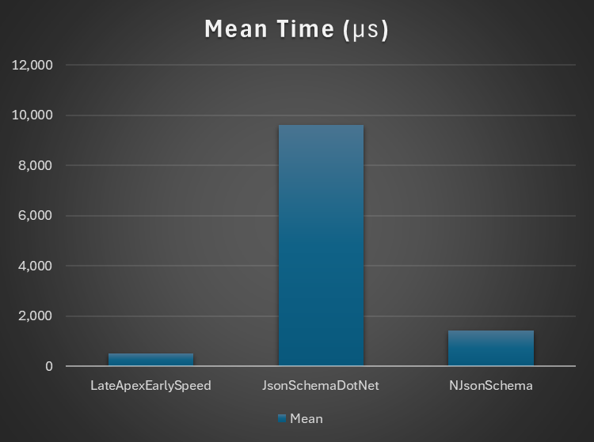
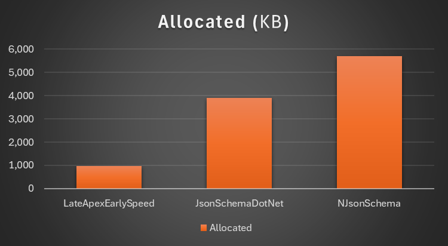
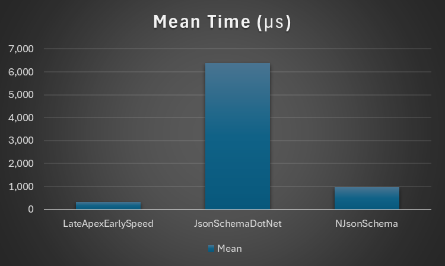
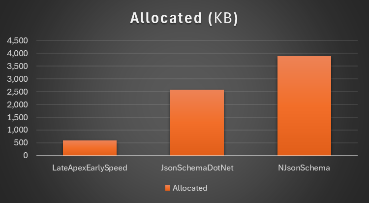
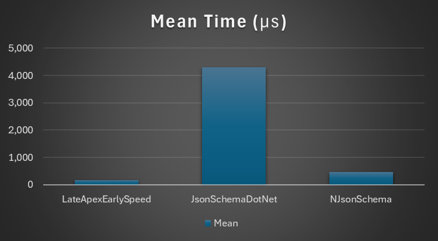
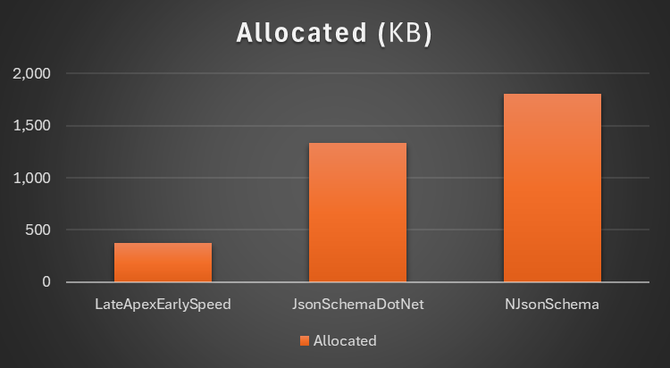

# .NET JSON Schema validator performance comparison

This document summarizes performance comparison evidence for [LateApexEarlySpeed.Json.Schema](../README.md#lateapexearlyspeedjsonschema), a high-performance .NET JSON Schema validator implementation based on `System.Text.Json`.

Related links:

- NuGet package: [LateApexEarlySpeed.Json.Schema](https://www.nuget.org/packages/LateApexEarlySpeed.Json.Schema/)
- Repository performance wiki: [Performance](https://github.com/lateapexearlyspeed/Lateapexearlyspeed.JsonSchema/wiki/Performance)
- Medium/Dev Genius article: [Performance comparison of JSON Schema implementations for .NET](https://blog.devgenius.io/performance-comparison-of-json-schema-implementations-for-net-ead3d092a473)
- Benchmark source: [Json.Schema.Libraries.Benchmark](../Json.Schema.Libraries.Benchmark/)

## Primary Benchmark: Official JSON Schema Test Suite Comparison

The primary comparison benchmark in this repository is [Json.Schema.Libraries.Benchmark](../Json.Schema.Libraries.Benchmark/). It uses cases from the official [JSON Schema Test Suite](../JSON-Schema-Test-Suite/) and compares multiple .NET JSON Schema validator implementations.

The benchmark runner is implemented in [JsonSchemaValidationRunner.cs](../Json.Schema.Libraries.Benchmark/JsonSchemaValidationRunner.cs), with BenchmarkDotNet benchmark entry points in [BenchmarkTests.cs](../Json.Schema.Libraries.Benchmark/BenchmarkTests.cs).

The Medium/Dev Genius article reports this benchmark setup:

- Candidate implementations were selected from the JSON Schema official tools list and other widely used .NET implementations.
- The benchmarked implementations were `JsonSchema.Net v7.3.4`, `NJsonSchema v11.2.0`, and `LateApexEarlySpeed.Json.Schema v1.2.1`.
- `Json.NET Schema` / `Newtonsoft.Json.Schema` was discussed, but it was not included in the published run because licensing prevented high-call-count benchmark execution.
- Benchmark data was based on the official JSON Schema Test Suite.
- Tests involving external schema document references and IO were excluded so measured time did not include network or file access.
- Only tests that all compared implementations could pass were included.
- The final published comparison used 700 passing tests in JSON Schema Draft 2020-12.

## Primary Comparison Results

The following screenshots are copied from the published Medium/Dev Genius article into this repository so the benchmark evidence remains available with the source code. The images show the BenchmarkDotNet result tables for the official-test-suite based multi-library comparison.



### Scenario 1: Build Schema Object Then Validate JSON Instance

This scenario measures schema construction plus validation. It represents workloads where an application receives new schemas and cannot cache parsed or built validator state.





### Scenario 2: Reuse Built Schema Object And Validate JSON Instance

This scenario measures validation when schema or validator instances can be reused. It represents the recommended pattern for repeated validation against known schemas.





### Scenario 3: Reuse Built Schema Object For Positive Cases

This scenario measures reusable-schema validation for valid instances. It represents workloads where most incoming JSON documents are expected to be valid.





### Scenario 4: Reuse Built Schema Object For Negative Cases

This scenario measures reusable-schema validation for invalid instances. It is separated from positive cases because implementations can differ in how much error information they produce.





## Secondary Benchmark: Large Keyword-Coverage Schema

The secondary benchmark project is [LateApexEarlySpeed.Json.Schema.Benchmark](../LateApexEarlySpeed.Json.Schema.Benchmark/). It is a focused BenchmarkDotNet benchmark using a large representative schema containing many JSON Schema keywords.

That benchmark compares `LateApexEarlySpeed.Json.Schema` with `JsonSchema.Net` for one schema and instance pair. Its benchmark implementation is in [BenchmarkTestClass.cs](../LateApexEarlySpeed.Json.Schema.Benchmark/BenchmarkTestClass.cs), with schema and instance data in [schema.json](../LateApexEarlySpeed.Json.Schema.Benchmark/schema.json) and [instance.json](../LateApexEarlySpeed.Json.Schema.Benchmark/instance.json).

Environment:

- CPU: 12th Gen Intel Core i7-12800H, 1 CPU, 20 logical and 14 physical cores
- Runtime: .NET 6.0.25, X64 RyuJIT AVX2
- Benchmark framework: BenchmarkDotNet

Valid data case:

| Method | Mean | Error | StdDev | Gen0 | Gen1 | Allocated |
| --- | ---: | ---: | ---: | ---: | ---: | ---: |
| ValidateByPopularSTJBasedValidator | 29.80 us | 0.584 us | 0.573 us | 4.4556 | 0.2441 | 55.1 KB |
| ValidateByThisValidator | 15.99 us | 0.305 us | 0.300 us | 1.9531 | - | 24.2 KB |

Invalid data case:

| Method | Mean | Error | StdDev | Median | Gen0 | Gen1 | Allocated |
| --- | ---: | ---: | ---: | ---: | ---: | ---: | ---: |
| ValidateByPopularSTJBasedValidator | 65.04 us | 2.530 us | 7.341 us | 66.87 us | 4.5776 | 0.1221 | 56.42 KB |
| ValidateByThisValidator | 15.47 us | 1.160 us | 3.421 us | 17.14 us | 1.4954 | - | 18.45 KB |

## How To Run Locally

From the repository root, run the multi-library official-test-suite benchmark:

```powershell
dotnet run -c Release --project Json.Schema.Libraries.Benchmark
```

Run the focused large keyword-coverage benchmark:

```powershell
dotnet run -c Release --project LateApexEarlySpeed.Json.Schema.Benchmark
```

For lower-noise benchmark results, close other heavy applications and run on a machine using a stable power/performance profile.

## What The Benchmarks Measure

The benchmark projects cover different performance dimensions:

- Schema construction plus validation for workloads where schemas are not reused.
- Reusable schema or validator validation for repeated validation against known schemas.
- Positive-case validation, where input JSON is valid.
- Negative-case validation, where input JSON is invalid and error reporting behavior can affect cost.
- Allocation behavior, using BenchmarkDotNet memory diagnostics.
- Official JSON Schema Test Suite based cases in the primary multi-library benchmark.
- A focused large keyword-coverage schema in the secondary benchmark.

## Caveats

Benchmark results depend on the .NET runtime version, CPU, operating system, power mode, schema shape, instance size, valid/invalid data mix, output/error verbosity, whether validators are reused, and competing library versions.

Use these benchmarks as evaluation evidence, not as a universal guarantee. For production decisions, rerun the benchmarks with schemas and data that look like your own workload.
